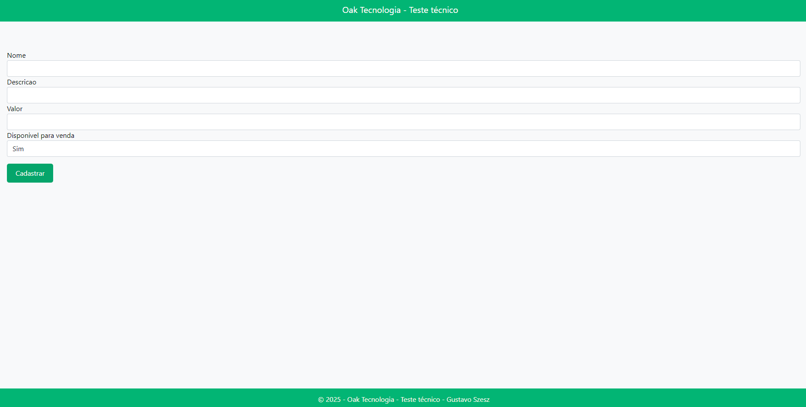
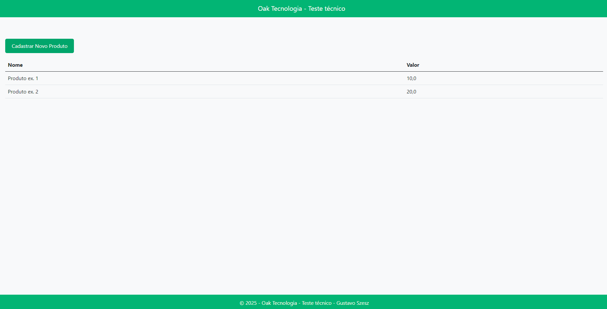

# Projeto de Cadastro e Listagem de Produtos - Teste técnico 

Este projeto é uma aplicação web desenvolvida em ASP.NET Core MVC com Blazor, que permite o cadastro e a listagem de produtos. A aplicação inclui um formulário para adicionar novos produtos e uma página para visualizar a lista de produtos cadastrados.

## Requisitos

### Cadastro e Listagem de Produtos

#### Cadastro:

- Formulário com os campos abaixo:
  - **Nome do produto** - campo de texto
  - **Descrição do produto** - campo de texto
  - **Valor do produto** - campo de valor
  - **Disponível para venda** - campo com 2 opções: sim / não

#### Listagem:

- Colunas da listagem: nome, valor
- Ordenação por valor do menor para o maior
- Quando cadastrar um novo produto, a listagem deve ser aberta automaticamente
- Deve existir um botão para cadastrar um novo produto a partir da listagem

## Telas

### Tela Inicial

### Tela de Cadastro

### Tela de Listagem de Produtos

## Como Executar

1. Clone o repositório:

git clone https://github.com/gustavo-szesz/OakTesteTecnico.git

2. Navegue até o diretório do projeto:

cd OakTesteTecnico

3. Restaure as dependências do projeto:
   dotnet restore
   
5. Execute a aplicação:
   dotnet run

## Tecnologias Utilizadas

- ASP.NET Core MVC
- Blazor
- Bootstrap

## Contribuição

Contribuições são bem-vindas! Sinta-se à vontade para abrir uma issue ou enviar um pull request.

## Licença

Este projeto está licenciado sob a Licença MIT. Veja o arquivo [LICENSE](LICENSE) para mais detalhes.
